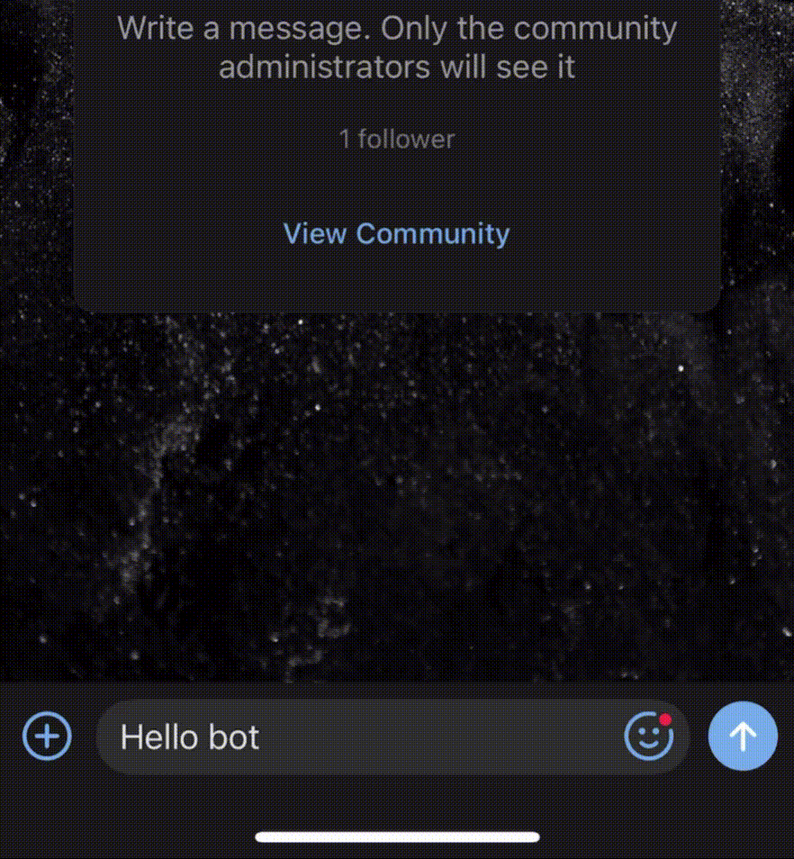

# Тестовое задание для компании Just Al

Бот Vk, повторяющий сообщение пользователя.

# Пример работы



# Стек технологий
* Kotlin
* Spring Boot
* Spring Web
* Lombok
* Java 21
* Gradle
* Docker

# Как запустить?

## Способ 1: Запустить готовый образ

### Шаг 1: Скачать образ:

```cmd
docker pull zvaryyka/simple-vk-bot:latest
```

### Шаг 2: Запустите Docker-контейнер с необходимыми параметрами, такими как токен VK API и версия VK API:

```cmd
docker run -d -p 8080:8080 -e VK_API_TOKEN="your_vk_api_token" -e VK_API_VERSION="5.236" zvaryyka/simple-vk-bot:latest
```

## Способ 2: Собрать Docker образ и запустить его

### Шаг 1: Скачать проект

#### Скачайте проект с помощью Git:

```cmd
git clone <url проекта>
```

#### Перейдите в директорию проекта:

```cmd
cd <название_проекта>
```

### Шаг 2: Сборка проекта с помощью Gradle

#### Выполните сборку проекта с помощью Gradle:

```cmd
./gradlew build
```

### Шаг 3: Создание Docker-образа

#### Создайте Docker-образ на основе Dockerfile:

```cmd
docker build -t zvaryyka/simple-vk-bot:latest .
```

### Шаг 4: Запуск Docker-контейнера

#### Запустите Docker-контейнер с необходимыми параметрами, такими как токен VK API и версия VK API:

```cmd
docker run -d -p 8080:8080 -e VK_API_TOKEN="your_vk_api_token" -e VK_API_VERSION="5.236" zvaryyka/simple-vk-bot:latest
```

# Теперь Spring приложение доступно по адресу http://localhost:8080.